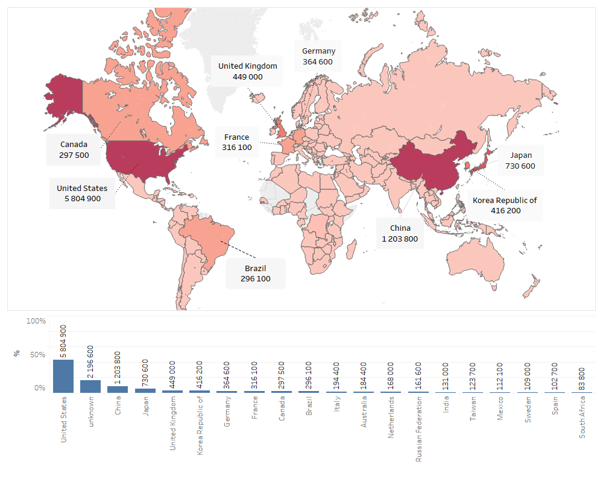

# Fraudulent_Activities
Les sites de E-commerce font transiter beaucoup d'argent. Cela peut engendrer des risques non négligeables d'activités frauduleuses, comme l'utilisation de carte de crédit volées, du blanchiment d'argent, etc.  Fort heureusement, le Machine Learning peut nous aider à identifier ces activités frauduleuses. Tous les sites web où vous devez entrer vos informations de paiements ont une équipe qui s'occupe de gérer les risques de fraude via le ML.  Le but de ce challenge est de construire un modèle qui vous permet de prédire une probabilité de transaction frauduleuse.

## Contexte: Flux des activités de transactions dans le monde

